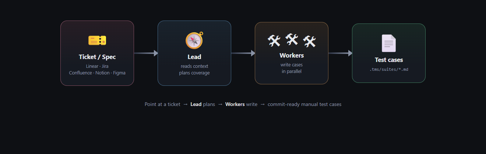
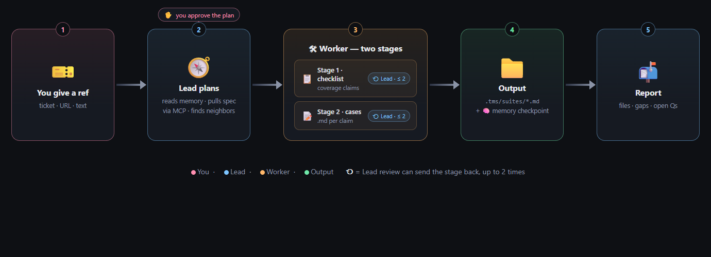
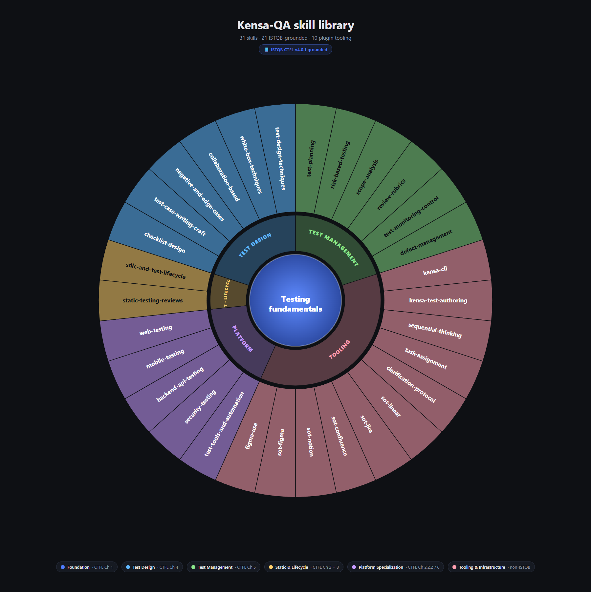

# Kensa-QA — a Manual QA Team Inside Claude Code

<p align="center">
  
</p>

<p align="center">
  <b>Point at a ticket. Get a coverage checklist and a folder of manual test cases — written in your project's style, ready to commit.</b>
</p>

<p align="center">
  Built for the <a href="https://kensa.dev">Kensa</a> TMS format (plain markdown under <code>.tms/suites/</code>), works on any project where test cases live in markdown.
</p>

<p align="center">
  📘 <b>ISTQB CTFL v4.0.1 grounded</b> — every reasoning skill cites the syllabus chapter and learning objective it teaches.
</p>

---

## What it does

<table>
<tr>
<td width="33%" valign="top">

### 📝 Author
Turn a Linear / Jira / Confluence / Notion / Figma ref — or raw pasted text — into a checklist plus 10–60 case files.

</td>
<td width="33%" valign="top">

### 🔄 Update
When a spec changes, find affected cases by source ref and rewrite only what changed. No hand-hunting.

</td>
<td width="33%" valign="top">

### 🔎 Audit
On large suites: flag stale drafts, duplicates, orphan steps, tag drift, missing source refs. Read-only by default.

</td>
</tr>
</table>

It writes manual test cases. It does **not** execute, automate, or replace a test runner.

Beyond authoring, it now spans the test side of the SDLC with **read-only analysis commands** — pull context from your trackers, statically review a spec for defects before any code, assess product risk, draft a test plan, deep-audit the whole case base by a fan-out of reviewers, and build a requirements→cases traceability matrix. See [SDLC coverage](#sdlc-coverage) below.

---

## How it works

<p align="center">
  
</p>

1. **`test-lead-agent`** reads your project memory, pulls the spec via MCP, and proposes a coverage plan.
2. **You approve** the plan. (Human gate — nothing spawns until you sign off.)
3. **`qa-engineer-agent`** workers run in parallel. Each writes its slice in two stages — checklist, then cases — with the Test Lead reviewing after each stage (up to 2 revision rounds per stage).
4. **Output**: new or updated `.md` cases, a project-memory checkpoint, and a report (files, gaps, open questions).

For strategic decisions ("how do we split this feature?", "negative-first or boundary-first?"), `/brainstorm` spawns three **strategists** in parallel for a deliberation round instead of writing cases.

Onboarding an export from another TMS? `/adapt-schema` reads a couple of your real case files and fits the project **schema** to them (via the `schema-bootstrap-agent`), then you import the full export through Kensa's Universal format — **data follows schema, never the reverse**. And `/blueprint` builds **node-graph automations** (`.tms/blueprints/`) with a first-class agent step that runs `claude`/`codex` inside the flow.

---

## The skill library

Every reasoning step is backed by an explicit skill — and **20 of the 33 skills cite ISTQB CTFL v4.0.1** chapters and learning objectives. The remaining 13 are plugin tooling (CLI, browser-driven QA, schema adaptation, Blueprints automation, on-disk format, SOT extractors, agent communication) that complements ISTQB without being derived from it.

<p align="center">
  
</p>

| Sector | Skills | ISTQB ref |
|---|---|---|
| 🟦 **Foundation** | `testing-fundamentals` | Ch 1 |
| 🟦 **Test Design** | `test-design-techniques`, `white-box-techniques`, `collaboration-based-approaches`, `negative-and-edge-cases`, `test-case-writing-craft`, `checklist-design` | Ch 4 |
| 🟩 **Test Management** | `test-planning`, `risk-based-testing`, `scope-analysis`, `review-rubrics`, `test-monitoring-control-completion`, `defect-management` | Ch 5 + §3.2 |
| 🟨 **Static & Lifecycle** | `sdlc-and-test-lifecycle`, `static-testing-reviews` | Ch 2 + 3 |
| 🟪 **Platform** | `web-testing`, `mobile-testing`, `backend-api-testing`, `security-testing`, `test-tools-and-automation-overview` | §2.2.2 / Ch 6 |
| 🟥 **Tooling** | `kensa`, `kensa-test-authoring`, `kensa-browser`, `kensa-mobile`, `kensa-http`, `kensa-results`, `kensa-blueprints`, 5 × `sot-*`, `figma-use`, `sequential-thinking`, `task-assignment`, `clarification-protocol` | non-ISTQB |

The Test Lead loads the management & static skills on demand. Every QA Engineer brief always loads `testing-fundamentals`, `test-design-techniques`, `negative-and-edge-cases`, `test-case-writing-craft`, and one platform skill — plus the matching SOT extractor for the ticket source.

---

## Install

kensa-qa ships **two clean engine builds from one monorepo** — one for Claude Code,
one for OpenAI Codex. No installer script. The built, ready-to-use folders live
under [`dist/claude/`](dist/claude) and [`dist/codex/`](dist/codex) — each fully
self-contained (agents, skills, hooks, manifest all inside).

| Engine | What runs the team | Installed into |
|---|---|---|
| **Claude Code** | Claude | `<project>/.claude/plugins/kensa-qa/` |
| **Codex** | OpenAI Codex CLI | `<project>/` — `.codex/agents/*.toml`, `.codex/prompts/`, `AGENTS.md`, `skills/`, `hooks/` |

**By hand (no IDE) — see [INSTALL.md](INSTALL.md):**

```
# Claude Code (complete, one-liner)
/plugin marketplace add rpluzhnikov/QA_agents
/plugin install kensa-qa@rpluzhnikov

# Codex (copy the build into your project root)
git clone https://github.com/rpluzhnikov/QA_agents.git
cp -R QA_agents/dist/codex/. /path/to/your-project/
```

**Via an IDE:** the IDE reads [`engines.json`](engines.json), offers the engine
picker, and copies the chosen build into the project.

After install, run `/setup` (Claude) or `/kensa-setup` (Codex) to bootstrap
`.tms/memory/` and wire your source-of-truth MCP servers.

### Building from source

Sources are split so the **33 skills have a single home** and never drift between engines:

```
shared/skills · shared/hooks · shared/templates   # one source, copied into both engines
engines/claude · engines/codex                     # engine-specific manifest + agents/prompts
scripts/build.ps1 · scripts/build.sh               # assemble + validate dist/<engine>
```

Edit a skill once under `shared/skills/`, then rebuild both engines:

```powershell
.\scripts\build.ps1     # Windows
```
```bash
sh scripts/build.sh     # macOS / Linux
```

The build copies `shared/*` into each engine, generates the per-engine drop README,
and validates that both engines carry all 33 skills and a valid manifest.

<details>
<summary><b>Prerequisites</b></summary>

- [Claude Code](https://docs.claude.com/claude-code/install) and/or the [OpenAI Codex CLI](https://developers.openai.com/codex), installed and signed in.
- Node.js with `npx` on PATH (for the bundled `sequential-thinking` MCP).
- The auto-checkpoint hook runs on **both** Windows (PowerShell, `*.ps1`) and macOS/Linux (`*.sh`); on Codex one `hooks/hooks.json` dispatches the right one per OS.
- No API keys: Linear / Atlassian / Notion / Figma all use browser OAuth on first connect.
</details>

---

## Verify

After the drop, in the project:

| Check | Expected |
|---|---|
| `/help` | `setup`, `new-feature`, `update-feature`, `save-memory`, `audit`, `brainstorm`, `pull-context`, `review-spec`, `risk-assess`, `test-plan`, `analyze-cases`, `traceability`, `run-routine`, `adapt-schema`, `blueprint` |
| Type `@` (Claude) | `test-lead-agent`, `qa-engineer-agent`, `schema-bootstrap-agent`, `strategist` appear as agents |
| `/hooks` | One **Stop** hook: checking memory checkpoint |

Anything missing → restart the host fully so it reloads the dropped files.

---

## First-time setup

```
/setup
```

Interactive: asks about your stack, case language, ticket tracker, wiki. Scans existing cases under `.tms/suites/` to learn your style.

Writes:
- `.tms/memory/` — conventions, glossary, SOT config (edit by hand any time)
- `.mcp.json` — MCP servers for your sources (restart Claude Code after this to connect)

---

## Commands

| Command | What it does |
|---|---|
| `/new-feature <ref>` | Pulls spec, plans, you approve, QA Engineers write cases under `.tms/suites/<suite>/` |
| `/update-feature <ref>` | Finds cases by `source_id`, reads new spec, adds/removes/rewrites only what changed |
| `/brainstorm <topic>` | Three strategists deliberate in parallel, output 2–3 finalists you pick from |
| `/audit` | Schema validation, duplicates, drift, tag check on the whole `.tms/`. Read-only by default |
| `/save-memory` | Captures session learnings to `.tms/memory/learned/`. Auto-runs after authoring on Windows |
| `/setup` | Bootstraps `.tms/memory/` and `.mcp.json`. Re-run to add a new SOT |

### Analysis & planning (read-only)

These six write **no** test cases — each produces one committable markdown artifact in `.tms/reports/` and never emits the memory checkpoint.

| Command | What it does |
|---|---|
| `/pull-context <ref>` | Gathers all SOT content + related cases into a dossier. Building block for the rest |
| `/review-spec <ref>` | Static review of a requirement (ISO 20246) — finds defects *in the spec* before any case is written |
| `/risk-assess <ref>` | Product risk register (likelihood × impact → level → recommended test depth) |
| `/test-plan <epic>` | ISTQB §5.1 test plan; folds in existing risk / context / brainstorm artifacts |
| `/analyze-cases [scope]` | Semantic deep-audit of the case base by a fan-out of 1–N reviewers — contradictions, semantic dupes, coverage gaps, convention drift. Complements the mechanical `/audit` |
| `/traceability [--deep]` | Requirements→cases matrix from `source_id`; `--deep` maps each acceptance criterion to cases |

<details>
<summary><b>Command details and examples</b></summary>

#### `/new-feature <ref>`
```
/new-feature LIN-42
/new-feature https://yourcompany.atlassian.net/wiki/spaces/...
/new-feature "Free-text spec pasted here"
```
The Test Lead pulls the spec, plans coverage, gets your sign-off, spawns QA Engineers for checklists, reviews, then has QA Engineers write the case files. Reports total case count, assumptions made, open questions for product.

#### `/update-feature <ref>`
```
/update-feature LIN-42
```
The Test Lead finds cases referencing the changed source (via `source_id` in frontmatter), reads the new spec, decides what to add/remove/rewrite. Same review + report flow as `/new-feature`.

#### `/brainstorm <topic>`
```
/brainstorm how to split the Discount Engine for parallel QA engineers?
/brainstorm should 2FA cases be negative-first or boundary-first?
```
The Test Lead picks three angles (scope, decomposition strategy, test technique), three strategists each argue one angle in parallel, cross-review round, then a comparison view with 2–3 finalists. Saved to `.tms/brainstorms/`, referenceable from `/new-feature` later.

#### `/audit`
Walks `.tms/` via the `kensa` CLI: schema validation, duplicates, stale drafts, orphan shared-steps, tag drift, qualitative sampling. Output to terminal + `.tms/reports/audit-YYYY-MM-DD.md`. Opt-in fixes per-batch with confirmation.

#### `/save-memory`
Auto-runs after `/new-feature` and `/update-feature` (enforced by the auto-checkpoint hook on Windows). Run manually mid-session to capture a new convention before more work happens.
</details>

---

## SDLC coverage

The commands map onto the QA side of the software lifecycle — shift-left first, authoring in the middle, repo intelligence across the whole base:

| SDLC stage | Command(s) | ISTQB skill surfaced |
|---|---|---|
| Requirements / static testing | `/pull-context`, `/review-spec` | `static-testing-reviews` (Ch 3) |
| Risk analysis & planning | `/risk-assess`, `/test-plan`, `/brainstorm` | `risk-based-testing` (§5.2), `test-planning` (§5.1) |
| Test design / authoring | `/new-feature`, `/update-feature` | `test-design-techniques` (Ch 4) |
| Test-base health & coverage | `/audit`, `/analyze-cases`, `/traceability` | `review-rubrics` (§3.2) |

Everything except authoring is read-only. The whole suite stays inside the mission — **it designs and reasons about tests, it does not execute them.**

---

## Sources of truth

| Source | Auth | Notes |
|---|---|---|
| Linear | Browser OAuth | |
| Jira | Browser OAuth | Atlassian Cloud |
| Confluence | Browser OAuth | Same Atlassian server as Jira; `/setup` runs CQL discovery for canonical spec pages |
| Notion | Browser OAuth | |
| Figma | Local socket | Requires Figma desktop with Dev Mode MCP enabled |

No API tokens. OAuth opens a tab on first use. Each source has a dedicated extraction skill (`sot-linear`, `sot-jira`, `sot-confluence`, `sot-notion`, `sot-figma`) that tells the agents where acceptance criteria typically live.

---

## Project memory — the `.tms/` directory

Everything the plugin learns lives in plain markdown / YAML. Read, edit, commit.

```
<your-project>/.tms/
├── memory/
│   ├── project.md         ← what this project is, stack, testing types
│   ├── conventions.md     ← how cases are written here
│   ├── glossary.md        ← domain terms and translations
│   ├── sot.yaml           ← source-of-truth config
│   └── learned/
│       ├── patterns.md
│       ├── shared-steps.md
│       └── tags.md
├── suites/                ← test cases, organized by feature
├── shared-steps/          ← reusable step sequences
├── reports/               ← /audit + analysis commands output (commit)
├── brainstorms/           ← /brainstorm output (commit)
└── routines/              ← browser routines RT-*.md (commit)
```

`project.md`, `conventions.md`, `glossary.md` are human-written, plugin reads only. `sot.yaml` is `/setup`-written, hand-edited later. `learned/*` is plugin-written; you review during memory checkpoint.

Byte-exact case file format: see `skills/kensa-test-authoring/`.

---

## FAQ

<details>
<summary><b>macOS / Linux — do the hooks work?</b></summary>

Yes, as of v0.8. The auto-checkpoint Stop hook ships as a POSIX
`*.sh` alongside the Windows `*.ps1` (`hooks/save-memory-stop.sh`),
with the identical stdin/stdout contract. On Codex, one
`hooks/hooks.json` dispatches the `.sh` by default and the `.ps1` via
`commandWindows`.
</details>

<details>
<summary><b>I ran <code>/setup</code> but Linear / Jira / Notion isn't reading anything.</b></summary>

You skipped the restart after `/setup`. MCP servers connect at session start — fully quit Claude Code and reopen. On first connect, a browser tab opens for OAuth. Still failing → run `/hooks` and `/help` to confirm the plugin loaded.
</details>

<details>
<summary><b><code>.tms/suites/</code> is empty. The plugin says "no cases yet".</b></summary>

Normal on a fresh project. `/new-feature` creates suite directories on first write. Already have cases from another tool? Drop them under `.tms/suites/<suite>/<id>.md` matching the `kensa-test-authoring` format and `/setup` will learn from them.
</details>

<details>
<summary><b>How do I disable the plugin in one project only?</b></summary>

Inside that project: `/plugin disable kensa-qa@rpluzhnikov`. Stays installed globally; just doesn't load there.
</details>

<details>
<summary><b>Can I edit <code>conventions.md</code> directly?</b></summary>

Yes, that's the intended workflow. The plugin re-reads memory at session start so changes take effect immediately. Want the plugin to *learn* from cases you wrote by hand? Re-run `/setup` and pick "update specific files".
</details>

<details>
<summary><b>QA Engineers vs Strategists — what's the difference?</b></summary>

`qa-engineer-agent` workers (spawned by `/new-feature`, `/update-feature`) *write* test cases. `strategist` agents (spawned by `/brainstorm`) *deliberate* — they argue strategic angles to help you decide on an approach, never write cases themselves.
</details>

<details>
<summary><b>What does "ISTQB CTFL v4.0.1 grounded" mean here?</b></summary>

Every reasoning skill in the plugin cites the specific ISTQB CTFL chapter, section, and learning objective it operationalises. When the Test Lead or a QA Engineer applies a technique (boundary value analysis, decision tables, risk-based prioritization, defect reporting…), it can name the syllabus authority for that decision. This makes the reasoning auditable for teams that need to justify their QA practice to regulated stakeholders, and it lets newcomers learn ISTQB by example: every test case the plugin writes is a worked example of one or more CTFL learning objectives.

The 10 non-ISTQB skills (the `kensa`, `kensa-test-authoring`, `sot-*` family, `figma-use`, `sequential-thinking`, `task-assignment`, `clarification-protocol`) are plugin infrastructure — they don't contradict ISTQB but aren't derived from it either; they carry a "non-ISTQB tooling" disclaimer at the top of their SKILL.md.
</details>

<details>
<summary><b>The session won't end — something about a memory checkpoint.</b></summary>

The auto-checkpoint hook requires `/save-memory` after `/new-feature` or `/update-feature` before the session can stop. Wait for the Lead to finish, or — if it's stuck — type the sentinel line `memory-checkpoint: done` to unblock.
</details>

---

<details>
<summary><b>Under the hood</b> (for the curious / plugin developers)</summary>

### Auto memory checkpoint
After every `/new-feature` and `/update-feature`, a `Stop` hook (`hooks/save-memory-stop.ps1` on Windows, `hooks/save-memory-stop.sh` on macOS/Linux) blocks the session from ending until the Lead emits `memory-checkpoint: done`. Behavior is controlled by `auto_save_learnings` in `.tms/memory/project.md`:
- `true` — silent saves, one-line report
- `false` (default) — yes/no/edit per candidate

If nothing to save, sentinel is still emitted with `(nothing to save this round)` appended.

### Bundled MCP
`sequential-thinking` ships with the plugin (declared in `plugin.json`, started automatically — no credentials). Powers the reasoning skill Lead and Workers use for hard scope and edge-case decisions.

### Skills
33 skills under `skills/`, auto-loaded via the plugin manifest. See the skill library section above for the full taxonomy. Highlights:

**ISTQB CTFL v4.0.1-grounded (20):**
- **Foundation:** `testing-fundamentals` (Ch 1)
- **Test design (Ch 4):** `test-design-techniques`, `white-box-techniques-overview`, `collaboration-based-approaches`, `negative-and-edge-cases`, `test-case-writing-craft`, `checklist-design`
- **Test management (Ch 5 + §3.2):** `test-planning`, `risk-based-testing`, `scope-analysis`, `review-rubrics`, `test-monitoring-control-completion`, `defect-management`
- **Static & lifecycle (Ch 2 + 3):** `sdlc-and-test-lifecycle`, `static-testing-reviews`
- **Platform / non-functional (§2.2.2 + Ch 6):** `web-testing`, `mobile-testing`, `backend-api-testing`, `security-testing`, `test-tools-and-automation-overview`

**Non-ISTQB tooling (13):**
- `kensa-test-authoring` — byte-exact `.tms/` on-disk format
- `kensa` — drive the `kensa` CLI (queries, bulk edits, context bundling, audit, schema adaptation)
- `kensa-browser` — drive the Kensa-launched Chrome via `kensa browser …` for live browser QA
- `kensa-blueprints` — design/validate/run node-graph automations (`kensa blueprint …`) with an agent step
- `sequential-thinking` — structured reasoning
- `figma-use` — programmatic Figma access for deep node inspection
- `sot-linear` / `sot-jira` / `sot-confluence` / `sot-notion` / `sot-figma` — extraction guides per source
- `task-assignment` — `test-lead-agent` → `qa-engineer-agent` delegation contract
- `clarification-protocol` — Test Lead ↔ user dialogue rules

</details>

---

## Roadmap

| Version | Highlights |
|---|---|
| v0.1 | Lead + Worker, 4 commands, project memory templates |
| v0.2 | Memory checkpoint protocol |
| v0.3 | SOT extraction skills; `sequential-thinking`, `figma-use`, `kensa`, `kensa-test-authoring` integrated; `.mcp.json` writer |
| v0.4 | Stop hooks (auto-checkpoint + debug log); marketplace manifest; `INSTALL.md` |
| v0.5 | `/audit`, `/brainstorm`, `strategist` agent, OAuth clarity, Confluence multi-page discovery, pre-seeded tag taxonomy, parallel-worker ID-range allocation, stuck-session detection |
| v0.6 | **BREAKING** — agents renamed to `test-lead-agent` and `qa-engineer-agent`. Full ISTQB CTFL v4.0.1 grounding: 10 new skills covering Chapters 1, 2, 3, §4.3, §4.5, §5.1, §5.2, §5.3, §5.5, Ch 6; existing 21 skills carry ISTQB citation blocks. Skill library wheel diagram. |
| v0.7 | **SDLC coverage** — 6 read-only analysis commands: `/pull-context`, `/review-spec`, `/risk-assess`, `/test-plan` (shift-left) and `/analyze-cases`, `/traceability` (test-base intelligence). `qa-engineer-agent` gains an `analyze` mode for fan-out review. No new agents or skills. |
| v0.8 | **Multi-engine + installer** (superseded by v0.9). Three install modes (Claude / native Codex / hybrid Claude→Codex worker) via an interactive `install.ps1` / `install.sh`; bash port of the hooks. |
| v0.9 | **Two clean engines, one monorepo.** Removed the hybrid delegation and the interactive installer. Skills now have a single home under `shared/`; `scripts/build.{ps1,sh}` assemble self-contained `dist/claude/` and `dist/codex/` builds an IDE drops straight into a project. Claude = standard plugin; Codex = project-scoped `.codex/agents/*.toml` + `AGENTS.md` + skills. |
| v0.11 | Migrated to **`kensa-cli` v0.15** commands; QA Engineers create cases with atomic `kensa-cli new` (id-range carving gone); removed the PostToolUse `kensa-sync` hook. |
| v0.12 | **Browser QA & routines.** New `kensa-browser` skill + `/run-routine` command + starter routine templates (smoke / form / visual baseline) driving the Kensa-launched Chrome via `kensa-cli browser`. Full `kensa-cli` rename pass; removed the `debug-log` Stop hook and trimmed the memory-checkpoint message. |
| v0.13 | **Schema adaptation & Blueprints.** New `schema-bootstrap-agent` + `/adapt-schema` fit the project schema to a user's existing TMS export (additive; data follows schema, never the reverse), handing off to Kensa's Universal-format importer. New `kensa-blueprints` skill + `/blueprint` command for node-graph automations (`.tms/blueprints/`) with a first-class agent (`prompt`) node that runs `claude`/`codex` inside the flow. |
| **v0.14 (current)** | **CLI renamed `kensa-cli` → `kensa`.** Dropped the `-cli` suffix across every skill, command, agent, prompt, template, and doc; the `kensa-cli` skill is now the `kensa` skill. Reverts the v0.12 rename. |
| v1.0 (planned) | Fixture registry (`.tms/fixtures/`); exploratory mode (`/explore`); defects commands (`/report-bug`, `/triage`) |

---

## License

MIT — see [LICENSE](LICENSE).

## Links

- [INSTALL.md](INSTALL.md) — install by hand (no IDE): Claude marketplace, Codex copy
- [CHANGELOG.md](CHANGELOG.md) — version history
- [Kensa](https://kensa.dev) — the TMS format this plugin targets
- [Claude Code](https://docs.claude.com/claude-code) — the host environment
